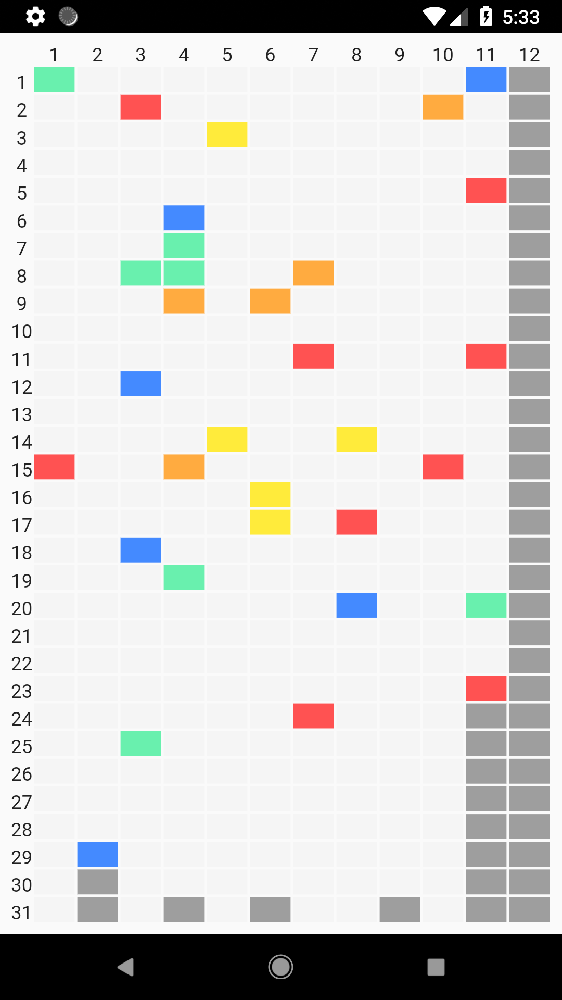
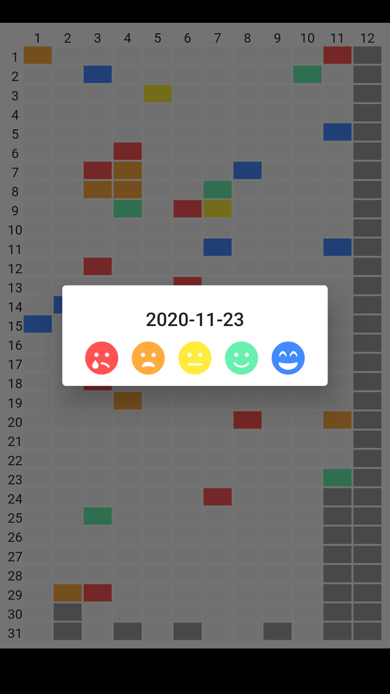

# years_in_flutter

A new Flutter project to improve bloc comprehension, learn cubit and much more.

# original idea

This project is based in an [old one](https://github.com/NauzetAduen/YearsInPixels), but is not my [idea](https://bulletjournal.com/blogs/bulletjournalist/deep-dive-year-in-pixels).

# functionality

As a demo project, a lot of functionalities will be missed.

- The project will only show our current year
  - maybe in the future I change this
  - Don't exactly know what to do with last year pixels for now
- You will be able to change past pixels in the current year
- The future pixels will be greyed out
- As you change a pixel, it will be stored in a local database
  - As for right now, I'm choosing between hive or sqflite

# main view

# dialog

# what's left
- years
- styling
- loading state with animations?
- refactoring / clean code...
